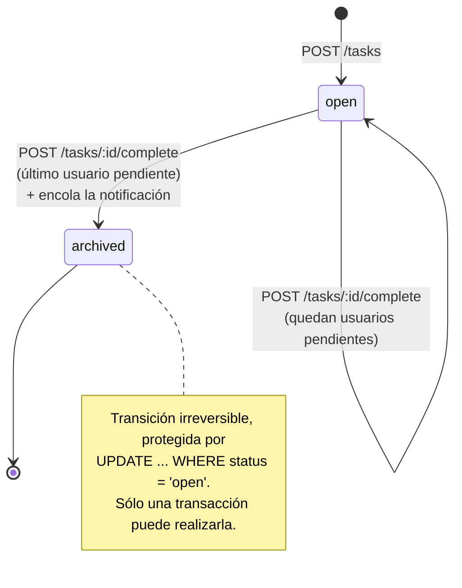
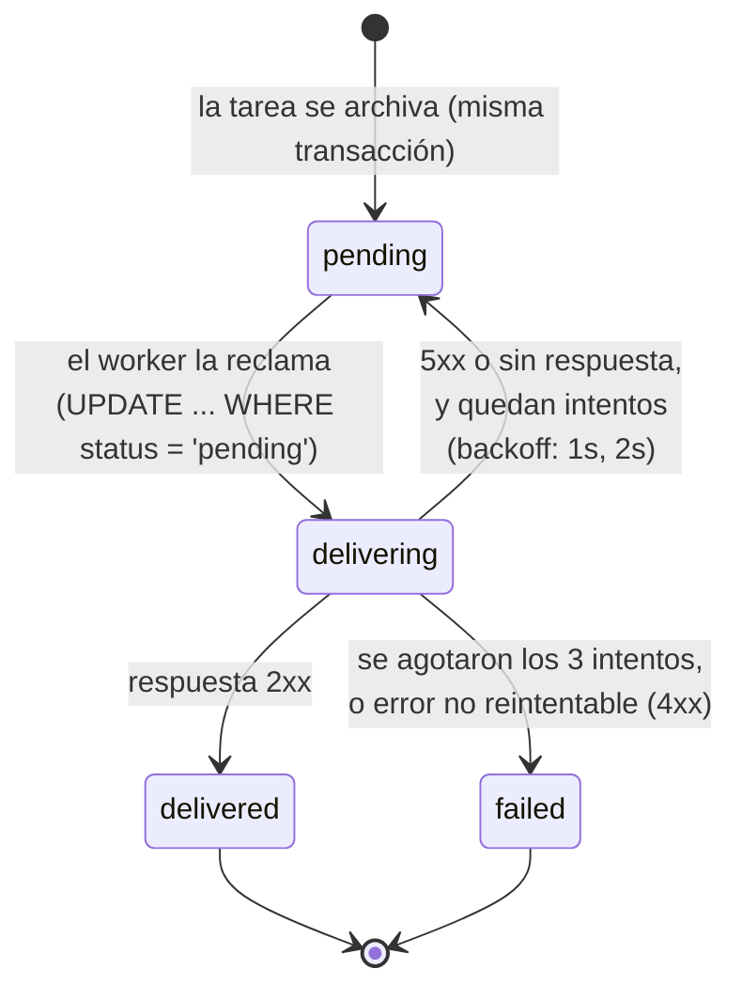

# UML — Estructura de la base de datos

Diagrama entidad-relación con tipos de datos y relaciones.
SQLite usa afinidad de tipos: `TEXT` para cadenas y timestamps ISO-8601 en UTC,
`INTEGER` para claves y contadores.

```mermaid
erDiagram
    USERS {
        INTEGER id PK "AUTOINCREMENT"
        TEXT    name          "NOT NULL"
        TEXT    last_name     "NOT NULL"
        TEXT    email         "NOT NULL, UNIQUE (minúsculas)"
        TEXT    created_at    "NOT NULL, ISO-8601 UTC"
    }

    TASKS {
        INTEGER id PK "AUTOINCREMENT"
        TEXT    title         "NOT NULL"
        TEXT    description   "NULL (opcional)"
        TEXT    status        "NOT NULL, CHECK IN (open, archived), default open"
        TEXT    created_at    "NOT NULL, ISO-8601 UTC"
        TEXT    updated_at    "NOT NULL, ISO-8601 UTC"
        TEXT    archived_at   "NULL; NOT NULL sí y sólo si status = archived"
    }

    TASK_ASSIGNMENTS {
        INTEGER task_id PK,FK "-> tasks.id, ON DELETE CASCADE"
        INTEGER user_id PK,FK "-> users.id, ON DELETE CASCADE"
        TEXT    assigned_at   "NOT NULL, ISO-8601 UTC"
        TEXT    completed_at  "NULL = parte pendiente"
    }

    NOTIFICATION_OUTBOX {
        INTEGER id PK "AUTOINCREMENT"
        INTEGER task_id FK "-> tasks.id, UNIQUE (una notificación por tarea)"
        TEXT    payload         "NOT NULL, JSON congelado al archivar"
        TEXT    status          "NOT NULL, CHECK IN (pending, delivering, delivered, failed)"
        INTEGER attempts        "NOT NULL, default 0"
        TEXT    next_attempt_at "NOT NULL, momento del próximo reintento"
        TEXT    claimed_at      "NULL; marca la entrega en curso"
        TEXT    created_at      "NOT NULL"
        TEXT    updated_at      "NOT NULL"
    }

    NOTIFICATION_ATTEMPTS {
        INTEGER id PK "AUTOINCREMENT"
        INTEGER task_id FK "-> tasks.id, ON DELETE CASCADE"
        INTEGER attempt_number "NOT NULL, UNIQUE junto con task_id"
        TEXT    status         "NOT NULL, CHECK IN (success, failed)"
        INTEGER http_status    "NULL cuando no hubo respuesta"
        TEXT    error          "NULL si tuvo éxito"
        TEXT    url            "destino del envío"
        INTEGER duration_ms    "duración del intento"
        TEXT    created_at     "NOT NULL, timestamp del intento"
    }

    TASK_EVENTS {
        INTEGER id PK "AUTOINCREMENT"
        INTEGER task_id FK "-> tasks.id, ON DELETE CASCADE"
        INTEGER user_id FK "-> users.id, NULL si lo originó el sistema"
        TEXT    type       "NOT NULL, CHECK IN (task.created, task.assigned, task.part_completed, task.archived, notification.delivered, notification.failed)"
        TEXT    payload    "NULL, detalle en JSON"
        TEXT    created_at "NOT NULL"
    }

    IDEMPOTENCY_KEYS {
        TEXT    idempotency_key PK "header Idempotency-Key"
        TEXT    method PK          "verbo HTTP"
        TEXT    path PK            "ruta del endpoint"
        TEXT    request_hash    "NOT NULL, SHA-256 del cuerpo canónico"
        TEXT    state           "NOT NULL, CHECK IN (in_progress, completed)"
        INTEGER response_status "status HTTP guardado"
        TEXT    response_body   "cuerpo JSON guardado"
        TEXT    created_at      "NOT NULL"
        TEXT    completed_at    "NULL mientras esté en curso"
    }

    USERS ||--o{ TASK_ASSIGNMENTS : "tiene asignadas"
    TASKS ||--o{ TASK_ASSIGNMENTS : "se asigna a"
    TASKS ||--o| NOTIFICATION_OUTBOX   : "encola 0..1 notificación"
    TASKS ||--o{ NOTIFICATION_ATTEMPTS : "registra intentos"
    TASKS ||--o{ TASK_EVENTS           : "registra eventos"
    USERS ||--o{ TASK_EVENTS           : "origina"
```

## Relaciones

| Relación | Cardinalidad | Implementación |
|---|---|---|
| `users` ↔ `tasks` | N:M | Tabla intermedia `task_assignments` con PK compuesta `(task_id, user_id)` |
| `tasks` → `notification_outbox` | 1:0..1 | `UNIQUE(task_id)`: como máximo una notificación por tarea |
| `tasks` → `notification_attempts` | 1:N | `UNIQUE(task_id, attempt_number)`: un registro por intento |
| `tasks` → `task_events` | 1:N | Bitácora append-only ordenada por `id` |
| `users` → `task_events` | 1:N | `ON DELETE SET NULL`: borrar un usuario no borra la historia |

## Invariantes que sostiene el esquema

1. **Una asignación por par (tarea, usuario)** — la PK compuesta de `task_assignments`
   hace imposible duplicar la relación, aun con requests concurrentes.
2. **`status` y `archived_at` no pueden contradecirse** — el `CHECK` de `tasks`
   fuerza que una tarea esté archivada si y sólo si tiene fecha de archivado.
3. **Una sola notificación por tarea** — `UNIQUE(task_id)` en `notification_outbox`.
   Es la garantía de "exactamente una vez" a nivel de base, independiente del
   código de la aplicación.
4. **Un registro por intento** — `UNIQUE(task_id, attempt_number)` impide contar
   dos veces el mismo intento si un ciclo de entrega se repitiera.
5. **Una operación por clave de idempotencia y endpoint** — la PK
   `(idempotency_key, method, path)` es la sección crítica que sólo un request
   puede ganar.

## Ciclo de vida de una tarea

## Flujo de una notificación

